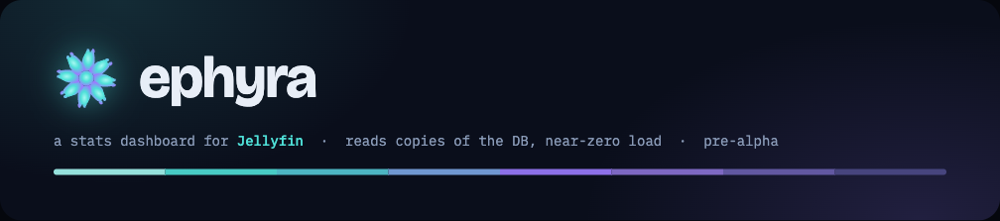

<p align="center">
  
</p>

# ephyra

A stats dashboard for Jellyfin. It reads copies of Jellyfin's SQLite files on a
schedule, rolls them up into its own small database, and serves the result as a
single Go binary with the frontend baked in. Standing load on Jellyfin is
basically nil.

Named after the juvenile stage of a jellyfin— sorry, jellyfish.

> **Pre-alpha.** Very much so. One page works, three are stubs, only one real
> Jellyfin (10.11.11) has been tested against, nothing is tagged, and anything
> here can change without notice. Run it if you're curious, not if you're
> relying on it.

**This build ships the Library page.** Watch Stats, Now Playing, and Cleanup are
stubs for now.

## What you need

- Jellyfin 10.11, running on the same Docker host.
- The ability to bind-mount Jellyfin's config directory into another container,
  read-only.
- A Jellyfin API key (Dashboard → API Keys → +). Only used for the live bits
  that aren't in this build yet; still required so the config is complete.

## Run it

```yaml
# docker-compose.yml
services:
  ephyra:
    image: ghcr.io/andriykohut/ephyra:latest
    environment:
      JELLYFIN_URL: http://jellyfin:8096
      JELLYFIN_API_KEY: ${EPHYRA_JELLYFIN_API_KEY}
      JELLYFIN_DATA_DIR: /jellyfin-data
    volumes:
      - /path/to/jellyfin/config:/jellyfin-data:ro
      - ephyra-data:/data
    ports:
      - "8080:8080"
    restart: unless-stopped
volumes:
  ephyra-data:
```

`docker compose up -d`, then open `http://<host>:8080`. The first refresh runs on
startup; the Library page fills in a second or two later.

The container runs as UID 65532. A fresh named volume for `/data` picks that up
automatically; if you bind-mount a host directory there instead, `chown 65532
<dir>` first.

No auth. Put it on your LAN, or behind whatever your reverse proxy already does
for login.

## Configuration

| Variable | Required | Default | Notes |
|---|---|---|---|
| `JELLYFIN_URL` | yes | — | e.g. `http://jellyfin:8096` |
| `JELLYFIN_API_KEY` | yes | — | not exercised in this build, still required |
| `JELLYFIN_DATA_DIR` | yes (unless `SOURCE=api`) | — | the read-only mount; DBs read from `<dir>/data/` or `<dir>/data/data/` |
| `SOURCE` | no | `auto` | `file` \| `api` \| `auto`. `api` is not implemented yet |
| `STORE_PATH` | no | `/data/ephyra.db` | Ephyra's own database |
| `WORK_DIR` | no | `/data/work` | scratch space for DB copies; must be writable |
| `LISTEN_ADDR` | no | `:8080` | |
| `REFRESH_LIBRARY` | no | `30m` | how often to re-read the library |
| `REFRESH_WATCH` | no | `10m` | unused in this build |
| `LIVE_POLL_INTERVAL` | no | `4s` | unused in this build |
| `DIRECT_READ` | no | `false` | skip the copy, read the live DB with `immutable=1`. Only if your mount is read-write |
| `STREAM_CAPACITY` | no | unset | unused in this build |
| `LOG_LEVEL` | no | `info` | `debug` \| `info` \| `warn` \| `error`; JSON to stdout |
| `TZ` | no | `UTC` | affects month bucketing on the growth chart |

## How it reads data

The Jellyfin mount is read-only, and SQLite won't open a WAL database read-only
without writing a `-shm` sidecar. So each refresh copies the item DB — `jellyfin.db` (plus its
`-wal` / `-shm`) — into `WORK_DIR`, queries the copy, and deletes it. If the file's
mtime hasn't changed since the last successful run, the refresh is skipped
entirely — libraries don't change often, so most runs do no work.

Ephyra never writes to Jellyfin or to the mounted directory.

## Test against a real library

`internal/source/file/queries.go` targets Jellyfin 10.11's `jellyfin.db`
(`docs/schema-notes.md`), checked against one real 10.11.11. Builds vary. Do this
after upgrading Jellyfin, or if the numbers look wrong.

### Get a copy of the item DB

10.11 keeps it in **`jellyfin.db`** at `<jellyfin-config>/data/jellyfin.db` — or
`<jellyfin-config>/data/data/jellyfin.db` on the linuxserver image. Older
installs have `library.db` in the same place. Bring the `-wal` and `-shm`
sidecars with it (WAL mode).

Jellyfin writes to it while running. Either stop Jellyfin for the copy, or copy
all three files live — Ephyra replays the WAL on its own copy, so a slightly torn
read of a library that isn't mid-scan is fine.

```sh
mkdir -p ~/ephyra-test/jf/data

# Jellyfin in a container (run wherever that container is):
cid=$(docker ps --filter name=jellyfin --format '{{.ID}}' | head -1)
db=$(docker exec "$cid" sh -c 'ls /config/data/jellyfin.db /config/data/data/jellyfin.db 2>/dev/null | head -1')
for f in "$db" "$db-wal" "$db-shm"; do
  docker cp "$cid:$f" ~/ephyra-test/jf/data/ 2>/dev/null || true
done

# Jellyfin not containerised: cp jellyfin.db* from <jellyfin-config>/data/
# Jellyfin on another machine: do the copy there, then scp/rsync the dir over.
```

### Check the schema

```sh
sqlite3 ~/ephyra-test/jf/data/jellyfin.db .schema | less
# or: JELLYFIN_DATA_DIR=~/ephyra-test/jf ./scripts/dump-jellyfin-schema.sh
```

Compare against `docs/schema-notes.md`. Mismatches (renamed tables/columns,
`TopParentId` semantics, HDR/Dolby-Vision fields) mean
`internal/source/file/queries.go` needs a tweak — the notes say which.

### Run against it and eyeball the numbers

```sh
JELLYFIN_URL=x JELLYFIN_API_KEY=x JELLYFIN_DATA_DIR=~/ephyra-test/jf \
  STORE_PATH=~/ephyra-test/ephyra.db WORK_DIR=~/ephyra-test/work \
  go run ./cmd/ephyra
```

Open `http://localhost:8080`. The totals, genre band, decade spread, disk-by-codec
and library growth should match what you know your library actually holds. If a
number is wrong, the query that produced it is in `internal/source/file/queries.go`
and the rollup is in `internal/aggregate/library.go`.

## Development

Two processes:

```sh
cd web && npm run dev      # :5173, proxies /api and /healthz to :8080
go run ./cmd/ephyra        # :8080
```

Point `JELLYFIN_DATA_DIR` at a directory with a `data/jellyfin.db`. There's a
throwaway fixture at `testdata/library.fixture.sql` if you don't want to touch a
real one:

```sh
mkdir -p /tmp/jf/data && sqlite3 /tmp/jf/data/jellyfin.db < testdata/library.fixture.sql
JELLYFIN_URL=x JELLYFIN_API_KEY=x JELLYFIN_DATA_DIR=/tmp/jf \
  STORE_PATH=/tmp/ephyra.db WORK_DIR=/tmp/ephyra-work go run ./cmd/ephyra
```

`make test` runs the Go tests. `make build` builds the frontend then the binary.
`make docker` builds the image.

## Design docs

`docs/superpowers/specs/` has the design spec; `docs/superpowers/plans/` has the
implementation plans. This is Plan 1 of 3.

## License

MIT — see `LICENSE`. Third-party components (the bundled fonts under the SIL
Open Font License, Apache ECharts, and the rest) are listed in `NOTICES.md`.

The **ephyra** name and the mark aren't covered by the MIT license — fork the
code freely, but don't ship it under this name or logo in a way that implies
it's the same project.
